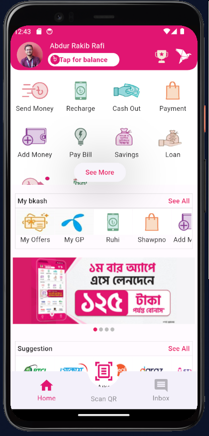
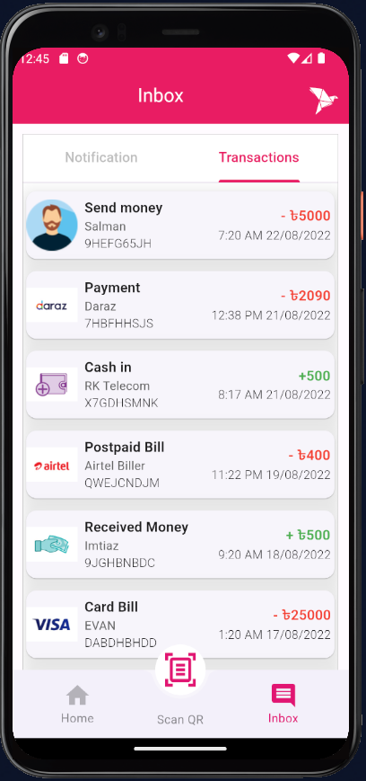
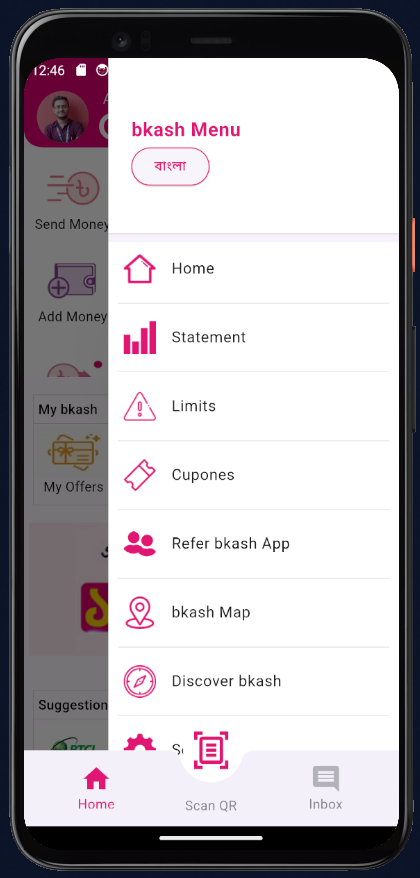
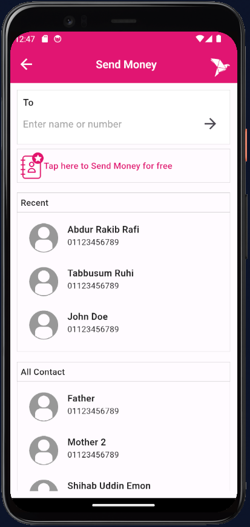
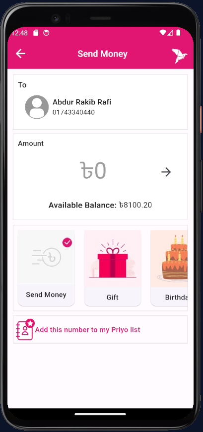
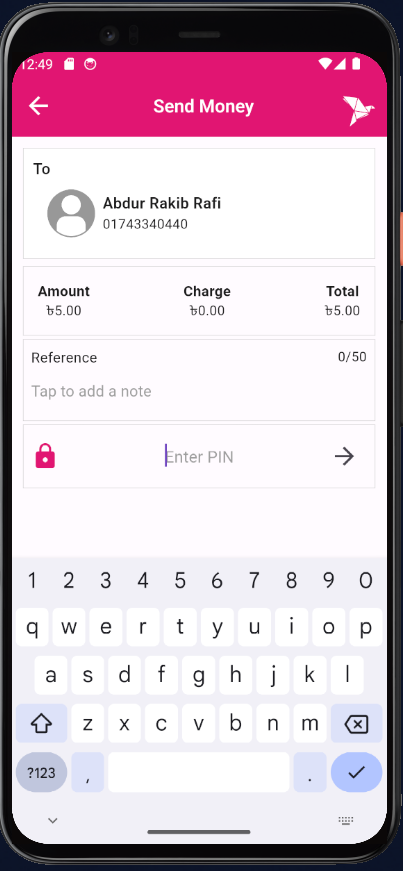
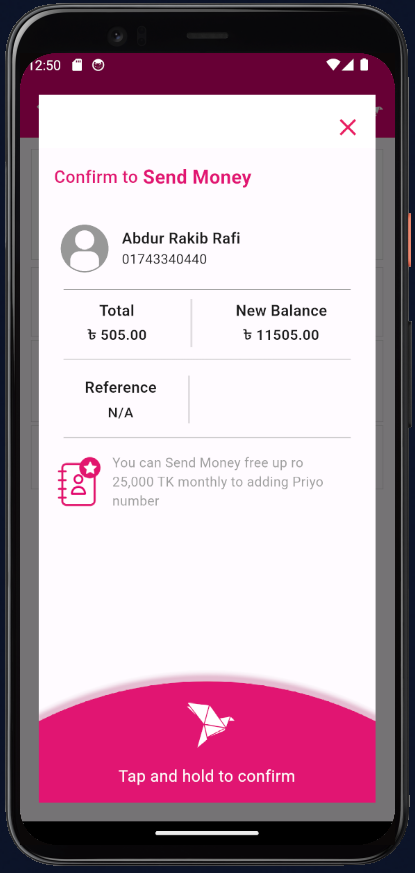
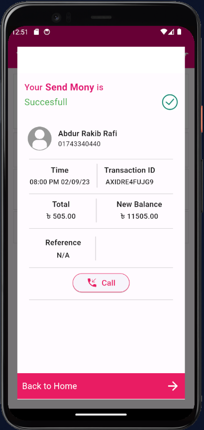

# bkash_ui

UI Clone of Popular **bkash** app, this is a popular MFS app in our BD. The reason for making it is industry level UI and its layout, animation which is standard and user friendly.

# Why do this:blush:	
Basically the reason for doing this UI is to try to make it realtime and how an industry level application needs to be, how accessible and user friendly it is, while doing this we have done many things like we know scaffold widget an app bar, a floating action button (FAB). and provides a framework for creating pages with various standard app features such as a bottom navigation bar. My main goal was to create all these structures and convert their various layouts correctly.

# App Screens :information_desk_person:

    
    
    
   

    
    
    
   

    

# Demo Video For better understanding 

https://github.com/abdurrakibrafi/bKash_UI/assets/86319780/c6426fd0-00f4-48fe-a0a1-cb388ab749fb

